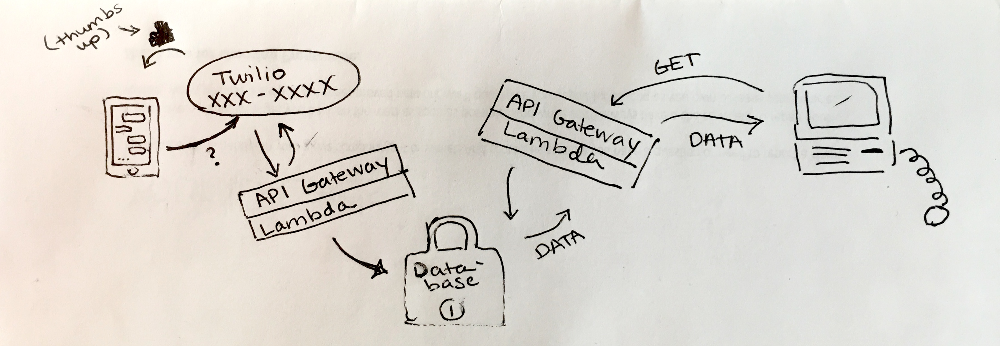

## vroombot

The web interface of [my React mileage widget](http://jesswray.com/vroombot).  I text it my odometer reading at fillups and the page displays statistics about my gas mileage.

If the display numbers look strange, I texted it some creative data while it was too cold to drive. ❄️ 🌨️ ☃️

The AWS Lambda functions are in the [vroombot_lambda](https://github.com/wrayjs/vroombot_lambda) and [vroombot_fetch](https://github.com/wrayjs/vroombot_fetch) repos.

How it works:



Created with create-react-app.

#### To view locally:

```
git clone https://github.com/wrayjs/vroombot.git
cd vroombot
yarn install
yarn start
```

#### Edit:
```
yarn watch-css
```

#### Deploy:

```
yarn predeploy
yarn deploy
```
